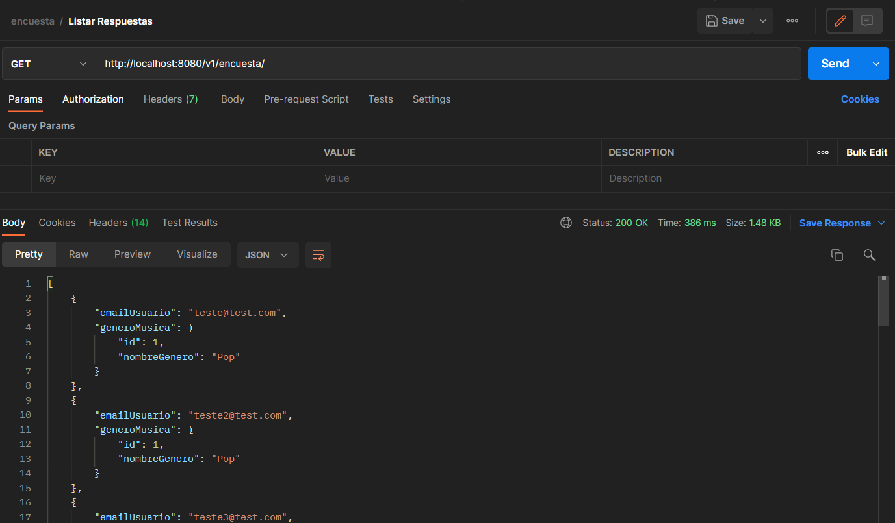

# Encuesta Backend
Desarrollado con Spring boot

## _HERRAMIENTAS NECESARIAS_
- Java 11.
- PostgreSQL 10+;


## Pasos para levantar el proyecto
- En la base de datos Postgres crear una base llamada *encuesta* con el siguiente comando.
```
CREATE DATABASE encuesta;
```
- Configurar el archivo *application.properties* con las credenciales de acceso

```
spring.datasource.url=jdbc:postgresql://localhost:5432/encuesta
spring.datasource.username=usuario
spring.datasource.password=contraseña
```
- Los comandos con la creación de la tabla y el reegistro de datos de encuentra en la carpeta *script*, el cual se ejecutará automaticamente al iniciar al proyecto.

Una vez levantado el proyecto la ruta será http://localhost:8080/.
Puede utilizar herramientas como postman para probar los servicios. 
Ej: realizando una petición get al http://localhost:8080/v1/encuesta/ para verificar el listado de respuestas



